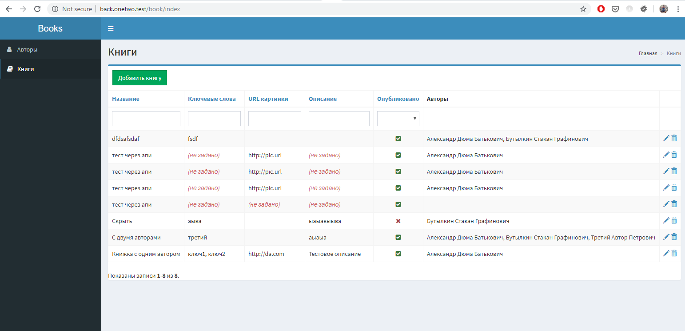

Ньюансы реализации
------------------

* Поле статус для простоты сделано is_published, хотя в реальном проекте я бы уточнил у заказчика, возможно его стоит сделать enum если статусов будет больше или даже связанной таблицей, если статусы планируют менять

* Slug у книг не реализован, т.к. его нет в ТЗ, в реальном проекте я бы обговорил этот момент

* Аплоад картинки не реализован, даётся лишь ссылка на неё. Если необходим аплоад, можно добавить функционал, но тогда бы хорошо отдельно описать это в точках входа АПИ, и сделать для аплоада картинки отдельную точку.

* Апи реализован стандартными ActiveControllers, т.к. для данной задачи их хватает с головой

* В Апи по факту не сделана сортировка по автору, т.к. автора у ниги может быть несколько, то не понятно, как именно производить сортировку. Но выборка по автору при этом существует (author=part_of_author_name)

* По той же причине авторы в АПИ выводятся в виде массива со своими данными, т.к. по ТЗ не понятно, как именно скрипты хотят получать доступ к этому свойству.

* Итого на работу от получения ТЗ до загрузки результата на гитхаб прошло 6 часов, из которых примерно 1.5 часа в сумме ушло на установку/настройку на домашнем хосте самого yii с необходимыми пакетами и перерывом на ужин.


Установка
-----

```
git clone https://github.com/steelice/onetwo-books.git
cd onetwo-books
composer install
php init
```
Прописать в common/config/main-local.php доступ к БД
```
php yii migrate
```
Прописать папки `api/web`, `frontend/web` и `backend/web` в веб-сервере так, чтобы они были доступны через веб

Можно пользоваться, бекенд доступен сразу без пароля:




Апи точка входа  для всех четырех операций: 
* GET /books?title=&author= список
* POST /books создание книги
* PUT /books/ID редактирование
* GET /books/ID просмотр одной книги
 
